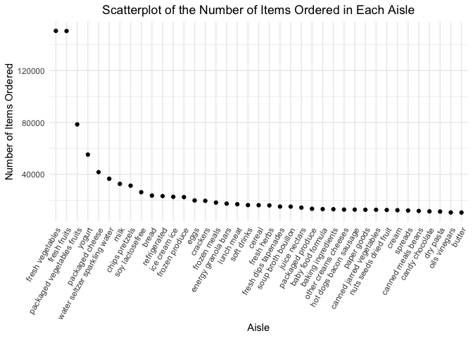

Homework 3
================
Emma Sexton <br>
Due: 15 October 2022

``` r
library(tidyverse)
library(ggridges)
library(patchwork)
```

## Problem 1

The goal of this problem is to explore the `instacart` dataset. First,
we will need to load the dataset:

``` r
library(p8105.datasets)
data("instacart")

instacart <- 
  instacart %>% 
  as_tibble(instacart)
```

#### Summary of the Dataset

The `instacart` dataset is an extensive dataframe that represents
product orders from the Instacart grocery service. The dataset contains
1384617 observations (rows), where each observation is a product from an
order, and 15 variables. Among the variables, there are various
identifiers, such as order, product, user, product, and department
identifiers (`order_id`, `product_id`, `user_id`, `product_id`, and
`department_id` respectively). There are also variables that detail
product and order information, such as:

-   `product_name`, `department`, and `aisle` which states the name of
    the product, as well as the department and aisle where the product
    is located
    -   Examples of products: `Bulgarian Yogurt`,
        `Organice Celery Hearts`, and
        `Lightly Smoked Sardines in Olive Oil`
    -   Examples of departments: `dairy eggs`, `produce`, and
        `canned goods`
    -   Examples of aisles: `yogurt`, `fresh vegetables`, and
        `canned meat seafood`
-   `add_to_cart_order` which details the order each product was added
    to the cart
-   `reordered` which identifies if the user has ordered the product in
    the past using binary coding (0 = no, 1 = yes)
-   `order_number` which signifies the order sequence number for the
    user
-   `order_dow`, `order_hour_of_day`, and `days_since_prior_order` which
    capture the day of the week on which the order was placed, the time
    the order was placed (hour of the day), and the days since the last
    order, respectively.

#### *Q1.1 How many aisles are there, and which aisles are the most items ordered from?*

``` r
instacart %>% 
  count(aisle) %>% 
  arrange(-n)
## # A tibble: 134 × 2
##    aisle                              n
##    <chr>                          <int>
##  1 fresh vegetables              150609
##  2 fresh fruits                  150473
##  3 packaged vegetables fruits     78493
##  4 yogurt                         55240
##  5 packaged cheese                41699
##  6 water seltzer sparkling water  36617
##  7 milk                           32644
##  8 chips pretzels                 31269
##  9 soy lactosefree                26240
## 10 bread                          23635
## # … with 124 more rows
```

There are 134 aisles. The aisles that have the most items ordered from
are `fresh vegetables` (n = 150,609), `fresh fruits` (n = 150,473), and
`packaged vegetable fruits` (n = 78,493).

#### *Q1.2 Make a plot that shows the number of items ordered in each aisle, limiting this to aisles with more than 10000 items ordered. Arrange aisles sensibly, and organize your plot so others can read it.*

``` r
instacart %>% 
  count(aisle) %>% 
  filter(n > 10000) %>% 
  mutate(aisle = fct_reorder(aisle, n, .desc = TRUE)) %>% 
  ggplot(aes(x = aisle, y = n)) +
  geom_point() +
  labs(
    y = "Number of Items Ordered",
    x = "Aisle",
    title = "Scatterplot of the Number of Items Ordered in Each Aisle"
  ) +
  theme_minimal() +
  theme(plot.title = element_text(hjust = 0.5),
    axis.text.x = element_text(angle = 60, hjust = 1))
```

<!-- -->

#### *Q1.3 Make a table showing the three most popular items in each of the aisles “baking ingredients”, “dog food care”, and “packaged vegetables fruits”. Include the number of times each item is ordered in your table.*

``` r
instacart %>% 
  filter(aisle == c("baking ingredients", "dog food care", "packaged vegetables fruits")) %>% 
  group_by(aisle, product_name) %>% 
  summarize(
    n_obs = n()
  ) %>% 
  mutate(product_rank = min_rank(desc(n_obs))) %>% 
  filter(product_rank < 4) %>% 
  arrange(desc(n_obs)) %>% 
  knitr::kable()
```

| aisle                      | product_name                                    | n_obs | product_rank |
|:---------------------------|:------------------------------------------------|------:|-------------:|
| packaged vegetables fruits | Organic Baby Spinach                            |  3324 |            1 |
| packaged vegetables fruits | Organic Raspberries                             |  1920 |            2 |
| packaged vegetables fruits | Organic Blueberries                             |  1692 |            3 |
| baking ingredients         | Light Brown Sugar                               |   157 |            1 |
| baking ingredients         | Pure Baking Soda                                |   140 |            2 |
| baking ingredients         | Organic Vanilla Extract                         |   122 |            3 |
| dog food care              | Organix Grain Free Chicken & Vegetable Dog Food |    14 |            1 |
| dog food care              | Organix Chicken & Brown Rice Recipe             |    13 |            2 |
| dog food care              | Original Dry Dog                                |     9 |            3 |

#### *Q1.4 Make a table showing the mean hour of the day at which Pink Lady Apples and Coffee Ice Cream are ordered on each day of the week; format this table for human readers (i.e. produce a 2 x 7 table).*

``` r
instacart %>% 
  filter(product_name %in% c("Pink Lady Apples", "Coffee Ice Cream")) %>% 
  group_by(product_name, order_dow) %>% 
  summarize(
    mean_hour = mean(order_hour_of_day)
  ) %>% 
  pivot_wider(., 
    names_from = order_dow,
    values_from = mean_hour
  ) %>% 
  knitr::kable(digits = 2)
```

| product_name     |     0 |     1 |     2 |     3 |     4 |     5 |     6 |
|:-----------------|------:|------:|------:|------:|------:|------:|------:|
| Coffee Ice Cream | 13.77 | 14.32 | 15.38 | 15.32 | 15.22 | 12.26 | 13.83 |
| Pink Lady Apples | 13.44 | 11.36 | 11.70 | 14.25 | 11.55 | 12.78 | 11.94 |

This table demonstrates the mean hour of the day at which Pink Lady
Apples and Coffee Ice Cream are ordered on each day of the week. Days of
the week range from 0 to 6 and the hour of the day is based on a 24h
clock.

## Problem 2

The goal of this problem is to load, tidy, and wrangle five weeks of
accelerometer data collected from a 63 year-old male with BMI 25. First,
we will load the dataset:

``` r
accelero_df <- 
  read_csv('data/accel_data.csv')
```

Next, we will tidy the dataset:

``` r
accelero_df %>% 
  pivot_longer(
    cols = activity.1:activity.1440,
    names_to = "minute",
    values_to = "activity_counts",
    names_prefix = "activity."
  )
## # A tibble: 50,400 × 5
##     week day_id day    minute activity_counts
##    <dbl>  <dbl> <chr>  <chr>            <dbl>
##  1     1      1 Friday 1                 88.4
##  2     1      1 Friday 2                 82.2
##  3     1      1 Friday 3                 64.4
##  4     1      1 Friday 4                 70.0
##  5     1      1 Friday 5                 75.0
##  6     1      1 Friday 6                 66.3
##  7     1      1 Friday 7                 53.8
##  8     1      1 Friday 8                 47.8
##  9     1      1 Friday 9                 55.5
## 10     1      1 Friday 10                43.0
## # … with 50,390 more rows
```
